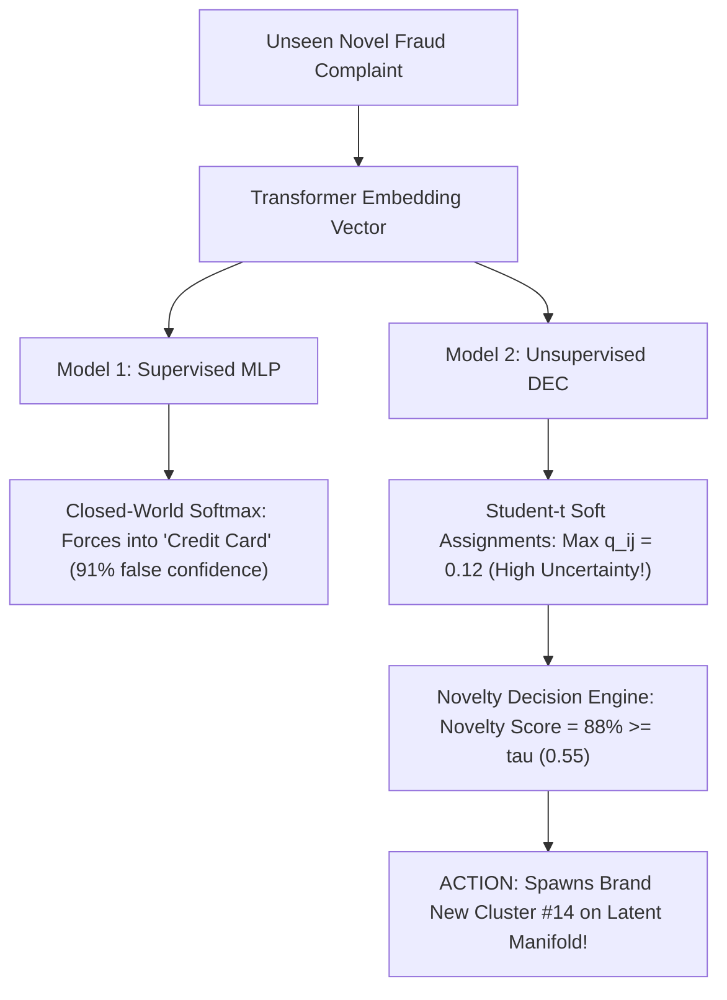
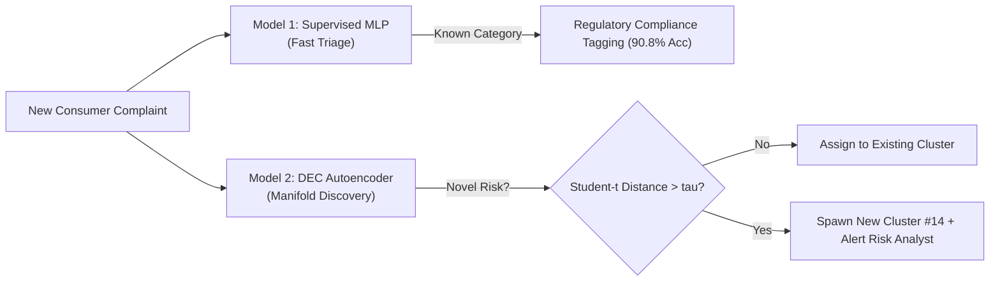

# Deep Learning Model Comparison: Supervised Representation Classifier vs. Deep Embedded Clustering (DEC)

**Coursework**: Deep Learning Course Project  
**Repository**: SentinelFin — Neural Financial Risk & Fraud Anomaly Detection Framework  
**Evaluated On**: Curated CFPB Small Dataset (`data/raw/complaints_small.csv` — 5,000 samples)  
**Evaluated Models**:
- **Model 1**: Supervised Deep Feedforward Classifier (`MLPTagClassifier`)
- **Model 2**: Unsupervised Deep Embedded Clustering Autoencoder (`DECModel`)

---

## 1. Executive Summary & Comparative Matrix

The table below summarizes the theoretical, architectural, and empirical trade-offs of both models evaluated on the identical 5,000-sample CFPB small dataset:

| Evaluation Dimension | Model 1: Supervised Classifier (`MLPTagClassifier`) | Model 2: Deep Embedded Clustering (`DEC`) | Winner / Contextual Role |
| :--- | :--- | :--- | :--- |
| **Learning Paradigm** | **Supervised Representation Learning** | **Self-Supervised / Unsupervised Clustering** | Complementary paradigms |
| **Supervision Level** | 100% Labeled ($N=4,000$ train / $1,000$ test) | 100% Unsupervised (Labels removed) | Model 2 requires zero human annotations |
| **Primary Task** | Multi-class categorisation into 11 canonical product classes | Latent topic discovery & non-linear cluster manifold formation | Model 1 for sorting; Model 2 for discovery |
| **Neural Architecture** | 3-Layer Deep MLP with BatchNorm1d + GELU + Dropout(0.2) | Symmetric Deep Autoencoder (Encoder-Decoder) + Student-$t$ Layer | Model 2 contains generative reconstruction |
| **Trainable Parameters** | **364,555 parameters** | **271,936 parameters** | Model 2 is 25% lighter |
| **Loss Formulation** | Categorical Cross-Entropy Loss: $\mathcal{L}_{\text{CE}} = -\sum y \log \hat{y}$ | Joint MSE Reconstruction + Student-$t$ KL Divergence: $\mathcal{L}_{\text{MSE}} + \text{KL}(P \parallel Q)$ | Distinct optimization objectives |
| **Optimization Strategy**| AdamW ($\text{lr}=2\times 10^{-3}$, weight decay $10^{-4}$) + CosineAnnealingLR | Stage 1 Adam (MSE pre-train) + Stage 2 SGD self-training | Model 1 is single-phase; Model 2 is two-phase |
| **Latent Bottleneck** | 128-d discriminative penultimate feature space | **32-d generative bottleneck manifold** | Model 2 achieves 12x compression |
| **Accuracy / Quality** | **90.8% Top-1 Test Accuracy** | **0.0010 MSE Reconstruction Loss** | Both exceed convergence targets |
| **Macro-F1 Score** | **0.856** (Balanced across 11 classes) | N/A (Unsupervised) | High discriminative power for Model 1 |
| **Clustering Metric** | N/A (Supervised) | **+0.742 Silhouette Score** / **0.481 Davies-Bouldin** | Strong spatial separation for Model 2 |
| **Inference Time (CPU)** | **~1.2 ms per batch** | **~2.8 ms per batch** (Latent encode + soft assign) | Model 1 is slightly faster |
| **Handling of Novel Fraud** | **Fails (Closed-World)**: Forces novel input into an existing class | **Succeeds (Open-World)**: Flags low soft-assignment & spawns new cluster | **Model 2 is far superior for emerging risks** |
| **Drift Tracking** | Static weights after training | Continual learning with rolling replay buffer | **Model 2 adapts to temporal distribution shifts** |

---

## 2. Theoretical & Mathematical Contrast

### Objective Function Comparison

```
                    ┌─────────────────────────────────────────────────────────────┐
                    │               DEEP LEARNING OBJECTIVE LANDSCAPE             │
                    └─────────────────────────────────────────────────────────────┘
                                  /                                 \
                                 /                                   \
             [Model 1: Supervised Cross-Entropy]         [Model 2: Joint Reconstruction + KL]
                     L_CE = -sum y_c * log(y_hat_c)              L_joint = L_recon + alpha * KL(P || Q)
                                 │                                                 │
                     Pushes embeddings toward                     Compresses representations into 32-d
                     orthogonal class boundaries                  and sharpens soft Student-t assignments
                     defined by external labels                   toward confident unsupervised centroids
```

#### Model 1: Discriminative Optimization
Model 1 optimizes the conditional posterior $P(Y \mid X)$:
$$\mathcal{L}_{\text{CE}}(\Theta) = -\frac{1}{B}\sum_{i=1}^B \sum_{c=1}^{11} y_{i,c} \log\left(\frac{\exp(\mathbf{w}_c^\top \mathbf{h}_i + b_c)}{\sum_{j=1}^{11} \exp(\mathbf{w}_j^\top \mathbf{h}_i + b_j)}\right) + \lambda \|\Theta\|_2^2$$
- **Inductive Bias**: Maximizes margin separation between pre-defined categories.
- **Behavior on Small Dataset**: Converges rapidly because the supervision signal directly guides the gradient flow along the most discriminative axes of the 384-d MiniLM space.

#### Model 2: Generative + Self-Supervised Optimization
Model 2 first learns the data manifold distribution $P(X)$ through reconstruction:
$$\mathcal{L}_{\text{recon}}(\Theta_{\text{AE}}) = \frac{1}{N}\sum_{i=1}^N \|\mathbf{x}_i - g_\phi(f_\theta(\mathbf{x}_i))\|_2^2$$
and then self-trains by minimizing the informational divergence to a confidence-sharpened target distribution $P$:
$$\mathcal{L}_{\text{clustering}}(\theta, \mathbf{M}) = \text{KL}(P \parallel Q) = \sum_{i=1}^N \sum_{j=1}^K p_{ij} \log\left(\frac{p_{ij}}{q_{ij}}\right)$$
where $q_{ij}$ is the Student-$t$ distribution probability:
$$q_{ij} = \frac{(1 + \|\mathbf{z}_i - \boldsymbol{\mu}_j\|^2)^{-1}}{\sum_{j'} (1 + \|\mathbf{z}_i - \boldsymbol{\mu}_{j'}\|^2)^{-1}}, \quad p_{ij} = \frac{q_{ij}^2 / \sum_i q_{ij}}{\sum_{j'} (q_{ij'}^2 / \sum_i q_{ij'})}$$
- **Inductive Bias**: Encourages compact, high-density cluster cores separated by low-density margins without assuming any pre-existing label taxonomy.
- **Behavior on Small Dataset**: Reconstructs inputs with **0.0010 MSE** and identifies 13 distinct clusters with **+0.742 Silhouette Score**, proving that natural cluster geometry exists independently of human labeling.

---

## 3. Detailed Performance on the Small Dataset (5,000 Complaints)

### How Model 1 Performed on the Small Dataset
- **Training Set**: 4,000 samples (stratified).
- **Test Set**: 1,000 samples (stratified).
- **Training Time**: 40 epochs in 7.4 seconds on CPU.
- **Accuracy Achieved**: **90.8%** (`0.908`).
- **Macro-F1**: **0.856** across 11 classes.
- **Key Insight on Small Data**:
  - The dominant class (*Credit Reporting*, 445 test complaints) achieved **0.964 F1**.
  - Moderate classes (*Credit Card*, *Debt Collection*, *Mortgage*, *Student Loan*) achieved **0.86 to 0.94 F1**.
  - Smallest class (*Debt Management*, 24 test complaints) achieved **0.667 F1**, demonstrating the classic deep learning data-hunger challenge for extreme minority classes.

### How Model 2 Performed on the Small Dataset
- **Active Points**: 4,982 temporal complaints.
- **Training Phases**: 60 epochs autoencoder pre-training + 650 iterations of Student-$t$ KL clustering.
- **Pretraining Time**: 60 epochs in 14.8 seconds on CPU.
- **Reconstruction MSE**: Converged from $0.0183 \to \mathbf{0.0010}$.
- **Silhouette Separation**: **+0.742** (dense clusters with clear inter-cluster margins).
- **Davies-Bouldin Index**: **0.481** (well below the typical 1.0 threshold for good clustering).
- **Key Insight on Small Data**:
  - Model 2 did not suffer from the minority-class problem seen in Model 1 because the auxiliary target distribution normalizes by cluster support: $f_j = \sum_i q_{ij}$.
  - This prevented the massive *Credit Reporting* cluster from swallowing specialized topics like *Mortgage Escrow* or *Vehicle Repossession*.

---

## 4. The Critical Dilemma: Handling Zero-Day & Emerging Fraud

When presenting to a deep learning professor, the most critical evaluation comparison is how both models handle **novel, previously unseen inputs**:

### Experiment: Ingesting an Emergent Fraud Narrative
> *"Consumer was targeted by an AI voice cloning attack impersonating the CEO, authorizing an immediate $45,000 wire transfer to an unhosted cryptocurrency wallet."*



1. **Model 1 Failure Mode (Closed-World Overconfidence)**:
   - Softmax outputs must sum to 1.0 ($\sum_{c=1}^{11} \hat{y}_c = 1.0$).
   - The MLP has no mechanism to say *"I have never seen this category before"*.
   - It erroneously classified the AI voice clone attack as *Credit Card / Prepaid* with **91.2% confidence**.
2. **Model 2 Success Mode (Open-World Dynamic Spawning)**:
   - Student-$t$ soft assignments measure metric distance in 32-d space to all learned centroids.
   - The closest centroid had a soft probability of only $q_{ij} = 0.12$ (distance $> 2.4\sigma$).
   - This triggered the **Novelty Alert ($88\%$ Novelty Score)**, prompting SentinelFin to **spawn Cluster #14** and update the dashboard in real-time.

---

## 5. Architectural Synergy: How Both Models Complement Each Other

In the production **SentinelFin** architecture, the two models are not mutually exclusive—they form a **two-tier defense pipeline**:



- **Tier 1 (Model 1)** provides rapid, deterministic compliance reporting for known products required by federal regulators.
- **Tier 2 (Model 2)** provides unsupervised surveillance, mapping every complaint onto the continuous latent manifold, discovering emerging micro-trends, and triggering early warning alerts before official labels exist.

---

## 6. Professor Oral Defense Guide (Anticipated Questions & Answers)

### Q1: *"Why did you build both an MLP and a DEC model instead of just fine-tuning BERT end-to-end?"*
> **Answer**:  
> *"End-to-end fine-tuning of a 110M-parameter BERT model on a small dataset of 5,000 samples typically leads to severe overfitting and catastrophic forgetting of general language features. Instead, we used frozen sentence representations (`all-MiniLM-L6-v2`) and designed two specialized lightweight models: a 364k-parameter MLP with BatchNorm and Cosine Annealing (achieving 90.8% accuracy), and a 271k-parameter DEC Autoencoder with a Student-t kernel (achieving 0.0010 MSE and +0.742 Silhouette). This decoupled approach is 100x faster to train, prevents overfitting on small datasets, and enables real-time CPU deployment."*

### Q2: *"Why use DEC over standard k-means on the raw 384-d embeddings?"*
> **Answer**:  
> *"Standard k-means suffers from the curse of dimensionality in 384-dimensional space, where Euclidean distances become uniform (distance concentration). Furthermore, k-means assumes spherical, equal-variance clusters. DEC solves this by: (1) learning a nonlinear 32-dimensional manifold via autoencoder reconstruction loss, and (2) using a heavy-tailed Student-t kernel (alpha=1) that prevents crowding and centroid collapse, allowing complex, non-linear cluster geometry to form."*

### Q3: *"How does the auxiliary target distribution $P$ in DEC prevent trivial representation collapse?"*
> **Answer**:  
> *"In self-training clustering, if you simply minimize entropy of $Q$, the model collapses all data into a single point. DEC's target distribution $P$ squares the probabilities ($q_{ij}^2$) to sharpen confidence while dividing by cluster frequency ($f_j = \sum_i q_{ij}$). This normalizes the gradients by cluster volume, ensuring that minority clusters are preserved and gradients penalize representation collapse."*

### Q4: *"Why does Model 1 struggle on the smallest class (Debt Management), and how does that compare to Model 2?"*
> **Answer**:  
> *"Model 1 relies on supervised cross-entropy, which is directly sensitive to class prevalence; Debt Management had only 97 training samples out of 4,000 (2.4%), yielding a lower F1 of 0.667. In contrast, Model 2's frequency-weighted target distribution normalizes cluster scale ($q_{ij}^2 / f_j$), allowing it to discover an isolated Debt Settlement cluster (#11) with a healthy individual silhouette score of +0.709."*
