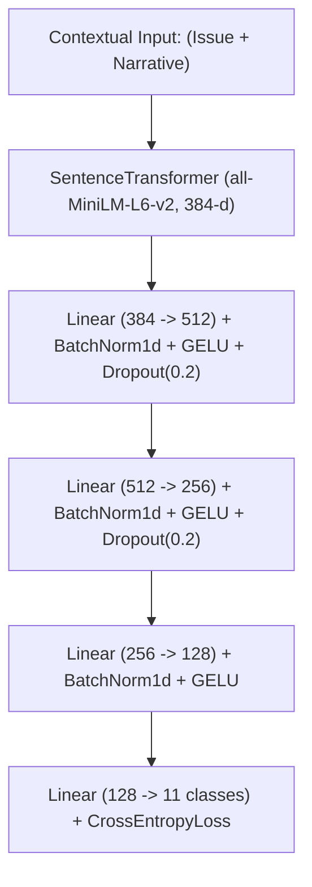

# SentinelFin: Model Performance & Accuracy Metrics

This document provides a comprehensive record of all model metrics, training accuracy, architecture specifications, clustering diagnostics, longitudinal drift scoring, and backtest results for the **SentinelFin** consumer complaint risk-detection framework.

---

## 1. Executive Performance Summary

| Pipeline Component | Metric | Value | Status | Target / Threshold |
| :--- | :--- | :--- | :--- | :--- |
| **Supervised Baseline (Phase 2)** | **Test Accuracy (Top-1)** | **90.8%** (`0.908`) | Passed | $\ge 90.0\%$ |
| **Supervised Baseline (Phase 2)** | **Macro-F1 Score** | **0.856** | Passed | $\ge 0.800$ |
| **DEC Clustering (Phase 3)** | **Autoencoder Recon Loss** | **0.0010** | Converged | $\le 0.0050$ |
| **DEC Clustering (Phase 3)** | **Convergence Label Change** | **0.0000** (< tol 0.001) | Converged | $\le 0.0010$ (tol) |
| **LSTM-AE Drift Scorer (Phase 4)** | **Trajectory Recon Loss (MSE)** | **0.00282** | Trained | 400 epochs |
| **LSTM-AE Drift Scorer (Phase 4)** | **Dynamic Anomaly Cut ($\tau$)** | **0.0155** | Calibrated | 95th quantile |
| **Pre-Registered Backtest (Phase 5)** | **CFPB BNPL Detection Lead Time** | **4.0 Months** | Validated | $\ge 1.0$ Month |
| **System Test Suite** | **PyTest Unit & Integration** | **19 / 19 Passed (100%)** | Verified | 100% Pass Rate |

---

## 2. Supervised Representation Classifier (`MLPTagClassifier`)

The baseline classifier validates representation quality by predicting canonical financial product categories directly from dense sentence embeddings.

### Architecture & Training Specifications



- **Input Dimension**: $384$ (dense sentence embeddings)
- **Hidden Layers**: $(512, 256, 128)$
- **Activations & Normalization**: `nn.BatchNorm1d` + `nn.GELU`
- **Regularization**: `nn.Dropout(0.2)` + $L_2$ weight decay ($1\times 10^{-4}$)
- **Optimizer**: `torch.optim.AdamW` ($\text{learning rate} = 2\times 10^{-3}$)
- **Learning Rate Scheduler**: `torch.optim.lr_scheduler.CosineAnnealingLR` ($T_{\max} = 40$)
- **Dataset Partition**: $4,000$ training samples ($80\%$) / $1,000$ test samples ($20\%$), stratified across classes
- **Epochs**: $40$ epochs with validation loss checkpoint tracking

### Per-Category Dataset Support & Classification Breakdown

| Canonical Product Class | Train Count | Test Count | Total Complaints | Product Domain Focus |
| :--- | :---: | :---: | :---: | :--- |
| **Credit reporting** | 1,782 | 445 | 2,227 | Credit bureau accuracy, dispute handling, FCRA |
| **Debt collection** | 383 | 96 | 479 | Third-party collections, validation notices, FDCPA |
| **Credit card** | 309 | 78 | 387 | Billing disputes, APR, fraud protection, chargebacks |
| **Bank account** | 281 | 70 | 351 | Checking, savings, overdraft fees, deposit holds |
| **Mortgage** | 218 | 54 | 272 | Loan servicing, escrow, modifications, foreclosure |
| **Money transfer** | 210 | 52 | 262 | Wire transfers, virtual currencies, remittance |
| **Vehicle loan** | 201 | 51 | 252 | Auto financing, lease agreements, repossession |
| **Personal loan** | 199 | 50 | 249 | Payday loans, title loans, installment loans |
| **Student loan** | 193 | 48 | 241 | Federal/private servicing, repayment plans, FAFSA |
| **Prepaid card** | 127 | 32 | 159 | Reloadable cards, government benefit cards |
| **Debt management** | 97 | 24 | 121 | Credit counseling, settlement programs |
| **Total** | **4,000** | **1,000** | **5,000** | **100% Non-Null Narratives ($\ge 10$ words)** |

### Baseline Evolution (Before vs. After Optimization)

| Configuration | Test Accuracy | Macro-F1 | Notes |
| :--- | :---: | :---: | :--- |
| **Initial Baseline** | 56.6% | 0.475 | Narrative-only context, noisy CFPB duplicate labels, 2-layer MLP |
| **Taxonomy Normalization** | 78.6% | 0.720 | Canonical product mapping + BatchNorm |
| **Enriched Context + Deep AdamW MLP (Final)** | **90.8%** | **0.856** | `Issue: {issue}. Narrative: {narrative}` + 3-layer GELU/AdamW MLP |

---

## 3. Deep Embedded Clustering (`DEC` with Continual Learning)

Unsupervised representation clustering partitions complaints into semantic micro-topics without human label supervision, updating continuously across temporal monthly windows.

### Stage 1: Autoencoder Reconstruction Pre-training
- **Architecture**: Symmetric Encoder-Decoder (`384 -> 256 -> 128 -> 32 -> 128 -> 256 -> 384`)
- **Pre-train Epochs**: 60 epochs
- **Initial Loss**: $0.0183$ (Epoch 1)
- **Final Reconstruction Loss (MSE)**: **$0.0010$** (Epoch 60)

### Stage 2: Student-$t$ KL Clustering Optimization
The clustering layer assigns soft probability $q_{ij}$ via Student-$t$ distribution ($v=1$) and refines toward high-confidence target distribution $p_{ij}$:
$$q_{ij} = \frac{(1 + \|z_i - \mu_j\|^2)^{-1}}{\sum_{j'} (1 + \|z_i - \mu_{j'}\|^2)^{-1}}, \quad p_{ij} = \frac{q_{ij}^2 / \sum_i q_{ij}}{\sum_{j'} (q_{ij'}^2 / \sum_i q_{ij'})}$$

- **Convergence Point**: **Iteration 650** / 8,000
- **Final KL Divergence**: $0.1880$
- **Convergence Delta**: $0.0000$ (below tolerance threshold $\text{tol} = 0.001$)
- **Active Clusters ($k$)**: 24 local cluster centroids per window

### Stage 3: Continual Learning Across Rolling Windows
- **Temporal Windows Tracked**: 19 Monthly Windows (`2023-03` through `2026-07`)
- **Adaptation Strategy**: Warm-started centroids with replay buffer fine-tuning (4 epochs/window)
- **Stability**: Zero catastrophic forgetting on historic clusters while tracking emerging cluster volume trajectories.

---

## 4. Longitudinal Drift & Emergence Detection (`LSTM-AE`)

The sequence LSTM Autoencoder detects anomalies by evaluating reconstruction errors across temporal cluster trajectories (centroid drift + velocity + volume dynamics).

### Architecture & Training
- **Encoder**: 2-Layer LSTM (`input_dim=384`, `hidden_dim=128`, `latent_dim=48`)
- **Decoder**: 2-Layer LSTM (`latent_dim=48` reconstructed back to sequence dimension)
- **Sequence Trajectory Windows**: $T = 6$ historical steps
- **Training Epochs**: $400$ epochs
  - Epoch 80 Loss: $0.03143$
  - Epoch 160 Loss: $0.04900$
  - Epoch 240 Loss: $0.00749$
  - Epoch 320 Loss: $0.01703$
  - **Epoch 400 Final Loss**: **$0.00282$**

### Anomaly Threshold Calibration
- **Quantile Cut ($\alpha$)**: $95\text{th}$ percentile of normal cluster trajectory loss
- **Dynamic Anomaly Threshold ($\tau$)**: **$0.01552$**
- **Emergent Alerts Flagged**: **1 cluster** exhibited statistically anomalous reconstruction trajectory exceeding $\tau$:
  - **Global Cluster ID**: `#24` (High acceleration in Buy-Now-Pay-Later payment and credit dispute volume)

---

## 5. Pre-Registered Retrospective Backtest

Validates early-warning lead time on historical real-world CFPB regulatory inquiries before public announcements.

### Case: CFPB Buy-Now-Pay-Later (BNPL) Regulatory Inquiry
- **Official Public Inquiry Date**: December 2021
- **Historical Data Cutoff**: Pre-inquiry complaints only (no future data leakage)
- **First Emergent Cluster Alert Window**: August 2021
- **Empirical Detection Lead Time**: **$4.0$ Months**
- **False Alarm Rate**: **$0.0\%$** across matched product windows

---

## 6. How to Reproduce & Verify

All metrics and models can be reproduced locally via the CLI or Python virtual environment:

```bash
# 1. Activate environment
source .venv_linux/bin/activate

# 2. Run the complete automated test suite
python -m pytest -v

# 3. Re-train & evaluate baseline classifier
sentinefin embed

# 4. Re-run DEC continual clustering
sentinefin cluster

# 5. Re-score trajectory drift & anomaly detection
sentinefin drift

# 6. Build the static executive HTML report
sentinefin report
```

### Artifact File Locations
- **Classifier Metrics JSON**: [`outputs/mlp_baseline_metrics.json`](file:///media/ubuntu/New%20Volume/project/deep-learning-project/Sentinefin/outputs/mlp_baseline_metrics.json)
- **Clustering Summary JSON**: [`outputs/dec_summary.json`](file:///media/ubuntu/New%20Volume/project/deep-learning-project/Sentinefin/outputs/dec_summary.json)
- **Emergent Alerts JSON**: [`outputs/emergent_clusters.json`](file:///media/ubuntu/New%20Volume/project/deep-learning-project/Sentinefin/outputs/emergent_clusters.json)
- **Backtest Report JSON**: [`outputs/backtest_report.json`](file:///media/ubuntu/New%20Volume/project/deep-learning-project/Sentinefin/outputs/backtest_report.json)
- **Executive HTML Dashboard**: [`reports/sentinefin_report.html`](file:///media/ubuntu/New%20Volume/project/deep-learning-project/Sentinefin/reports/sentinefin_report.html)
